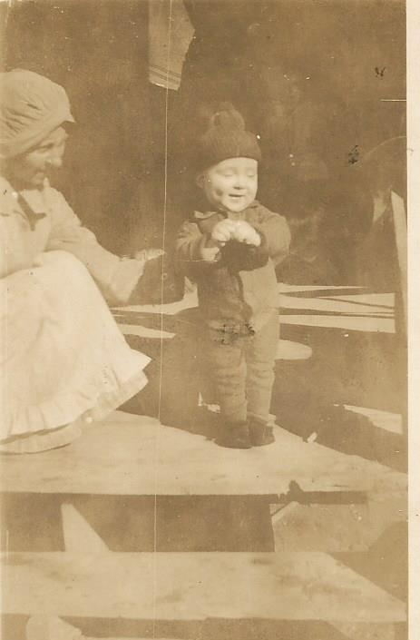

A few days later, Eugie rode out to their place to visit. She brought Florence a Bible and an invitation to a “Brush Arbor meeting” that was going to take place next week in Ft. Towson. There were some traveling preachers that were going to speak each night for as long as people were interested. Eugie said that they were “Cambellites” and could help Florence understand God’s plan for her and her family. In the meantime she suggested that Florence start reading in the New Testament – starting with the books of Luke and Acts and mark any passages that she didn’t understand so that she could ask questions at the meeting. She urged Florence to come, saying that she and Leeo could stay in town with her if it was okay with Andrew. “Florence, I really think you’ll find the answers to the questions you have about God if you’ll come to the meeting! I love you and I want you to feel God’s love, too!!” Florence agreed to talk with Andrew about the meeting, and to start reading the Bible. Eugie asked about Callie. Florence told her that Ben’s family had urged their daughter-in-law to stay back east with them and she had agreed to, at least for a few more weeks. The women hoped that this would give her time to heal and “cool down” a bit before coming back home.

Andrew thought it would be a fine idea for Florence to spend a few days with Eugie. He knew how hard Ben's death had been for all of them -- especially Florence. Her visits with Eugie had helped her more than anything. So Florence packed a few things for her and the baby and Andrew took them into town.

 

<strong>Florence and Leeo</strong>

The women had a great time talking and cooking and playing with Leeo. He was such a joy to everyone who met the sunny little boy!

Florence hadn't really known what to expect from the “Cambellite” preachers. She learned from Eugie and "Grandma Stanfield" (another, older woman who became a lifetime friend and sister in Christ) that they followed the teachings of a man named Alexander Campbell. "Brother" Campbell, along with several other men had been part of the Restoration Movement among churches in England and the United States that preached the concept of "speak where the Bible speaks and be silent where the Bible is silent". Preachers who went around using only the Bible -- not human creeds or books -- were often called "Cambellites" (most often by their critics). They called themselves simply "Christians". Eugie and Grandma Stanfield worshipped with a group in Ft. Towson who referred to themselves simply as the church of Christ. Throughout the week Florence learned the basic tenants of their faith: That belief is the first step in a life walked with Jesus; That belief comes from hearing the Word of God; That a person has to repent of the sins that they've committed and confess their belief that "Jesus is the son of God!" That an individual who is old enough to understand what sin is and repent of it is to be baptized for the remission of those sins. That "baptism" is to be fully immersed in water as it is a "burial" of the old man and coming out of the water to walk the new life with Jesus. The preachers were obviously convicted of the importance of what they were teaching, were passionate and read continuously from the Bible. Florence wasn't comfortable asking the strangers questions, but she could hardly wait each night to ask Eugie question after question. Eugie patiently and lovingly would go to the scriptures to show Florence the answers. On the last night of the meeting, Florence found herself compelled to answer the invitation call of the preacher. She answered the question "Do you believe that Jesus is the Son of God?" with a hearty "yes, sir, I DO!" The group made their way to the river that ran through town. Eugie and her husband had tears streaming down their faces as she held Leeo while Florence and the preacher went down into the water and he baptized her! Her life had taken a new pathway, and a new sense of peace came over her that she had never had in her 24 years! The bond she felt with Eugie for showing her this path would last a lifetime -- and beyond! She could hardly wait to get home and share all she'd learned with Andrew and Mr. Harris, and continue her Bible study!

As it turned out, Mr. Harris and Andrew were not all that interested in (in Mr. Harris' words) "that religious hobble gobble". It would be nearly 20 years before Andrew took an interest in learning about God, but, Florence wasn't discouraged in her decision and felt a new meaning in her life! In fact, years later she would say that if it hadn't been for Eugie teaching her about Christ, the events that were about to quickly unfold would've been her "undoing!"
